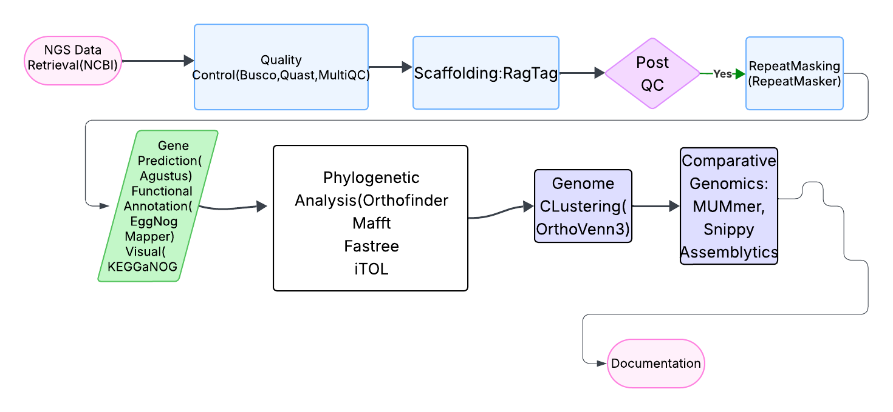
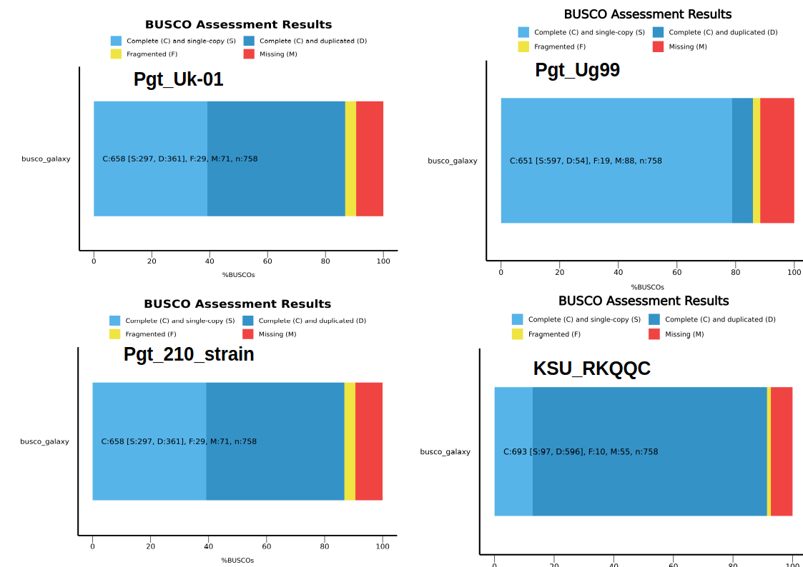
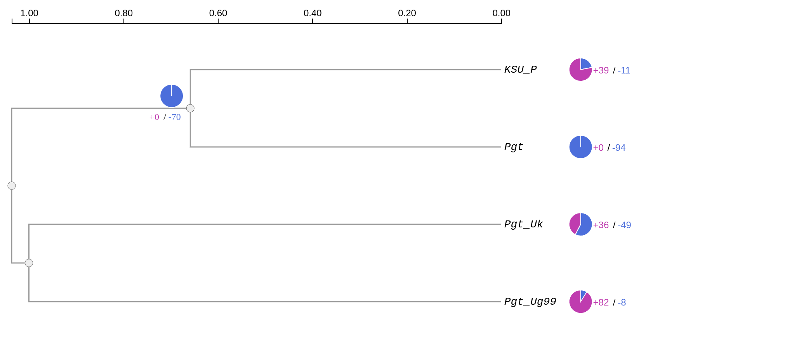
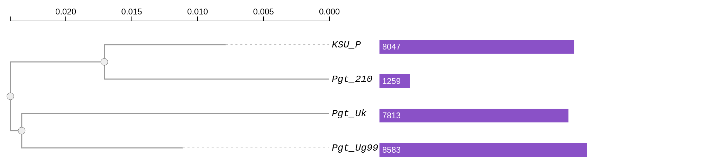
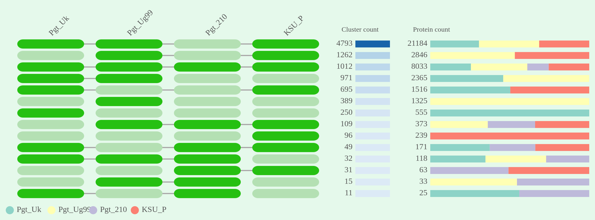
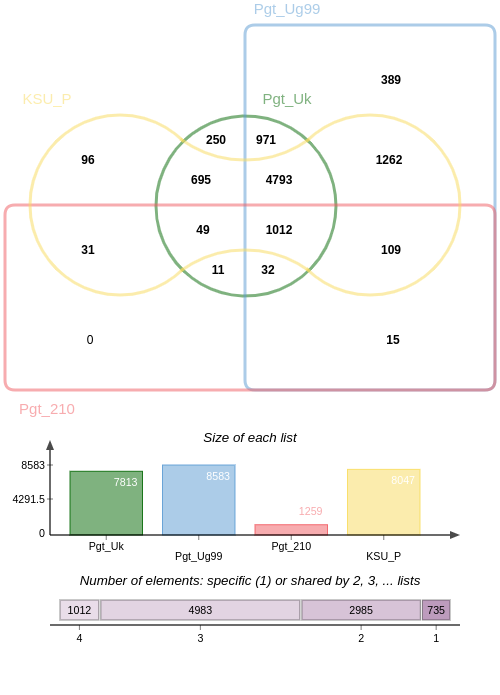
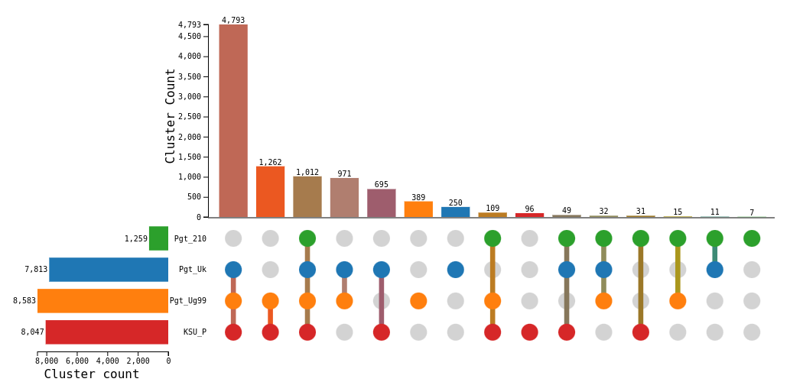
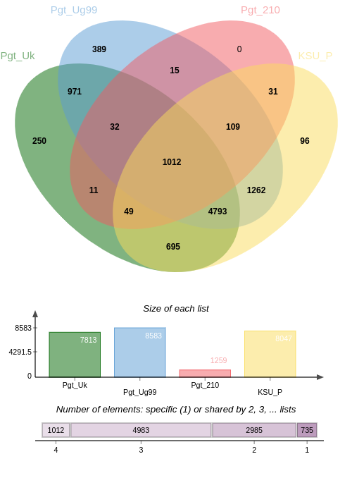
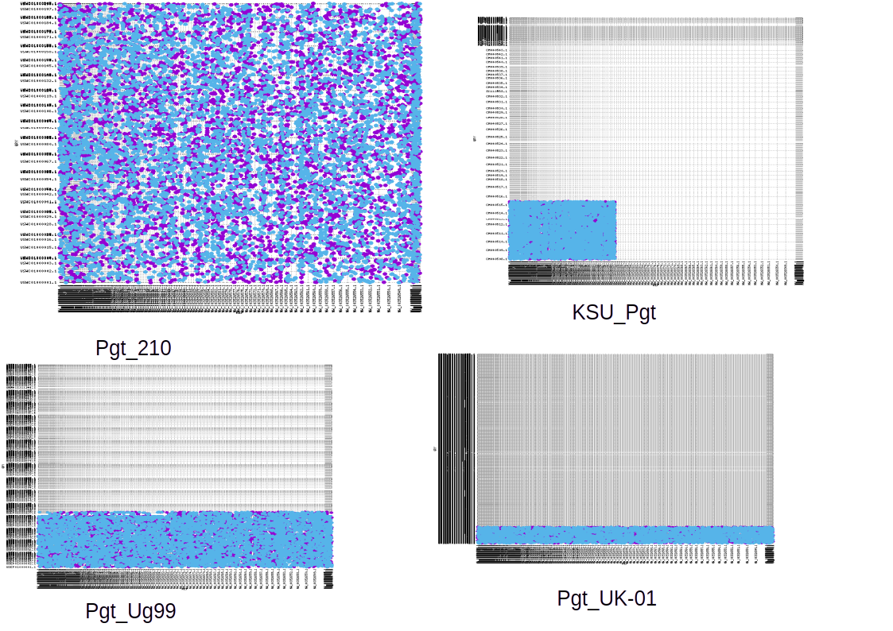
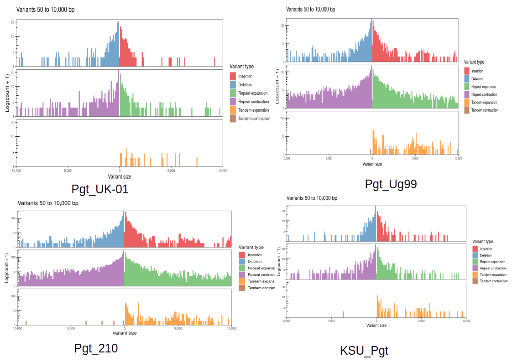

# Comparative Genomics and Phylogenetic Analysis of *Puccinia graminis* *f.sp* *tritici* in Wheat  
# Understanding the Genetic Basis of Pathogenicity

## 🧬 Overview

This project explores the genetic diversity and evolutionary relationships of *Puccinia graminis* f.sp. *tritici* — the fungal pathogen responsible for wheat stem rust. Through comparative genomics and phylogenetic inference, the study aims to shed light on genomic factors contributing to its pathogenicity and adaptation. This work is pivotal in enhancing our understanding of disease evolution and could support future strategies in disease management and resistance breeding in wheat.

---

### Prerequisites
- Linux Operating system
- Bash shell
- Tools installed :
  - Busco
  - QUAST
  - RagTag
  - RepeatMasker
  - Augustus
  - EggNOG-mapper
  - OrthoFinder
  - MAFFT
  - FastTree
  - MUMmer
  - Snippy

### Installation
To set up the environment and install the necessary tools, follow these steps:

#### Step 1: Install Conda or Mamba
If Conda or Mamba is not already installed on your system, follow the instructions below:

- **Install Conda**:
  Visit [Miniconda](https://docs.conda.io/en/latest/miniconda.html) or [Anaconda](https://www.anaconda.com/) to download and install Conda.

- **Install Mamba** (optional but faster alternative to Conda):
  After installing Conda, you can install Mamba using:
  ```bash
  conda install -n base -c conda-forge mamba
  ```

#### Step 2: Create a Conda Environment
Create a new environment for the pipeline and install the required tools:
```bash
conda create -n NGS-pipeline -c bioconda busco quast ragtag repeatmasker augustus eggnog-mapper orthofinder mafft fasttree mummer snippy
```

#### Step 3: Activate the Environment
Activate the newly created environment:
```bash
conda activate NGS-pipeline
```

#### Step 4: Verify Installation
Ensure all tools are installed and accessible:
```bash
busco --version
quast --version
ragtag.py --version
Repeatmasker --version
augustus --version
emapper --version
orthofinder --version
mafft --version
FastTree --version
mummer --version
snippy --version
```

#### Step 5: Run the Pipeline
Follow the methodology outlined in the **Methodology** section to execute the pipeline scripts.

## 🎯 Objectives

- **To identify the genetic diversity** among different strains of *P. graminis* f. sp. *tritici*.
- **To infer evolutionary relationships** between these strains using phylogenetic analysis.

---

## 🧪 Methodology

### 1. **Data Acquisition**
- Genome sequences were downloaded from the [NCBI Genome Database](https://www.ncbi.nlm.nih.gov/datasets/genome/?taxon=5297).

### 2. **Quality Assessment**
- **BUSCO**: Evaluated genome completeness.
- **QUAST**: Provided assembly statistics and quality reports.

### 3. **Genome Processing**
- **RagTag**: Scaffolded draft genomes using reference-based alignment.
- **RepeatMasker**: Identified and masked repetitive elements.
- **Augustus**: Predicted genes within the masked genome assemblies.

### 4. **Functional Annotation**
- **EggNOG-mapper**: Annotated predicted genes based on orthologous group assignment and functional domains.

### 5. **Phylogenetic Analysis**
- **OrthoFinder**: Identified orthologous gene clusters and single-copy orthologs.
- **MAFFT**: Performed multiple sequence alignment of single-copy orthologs.
- **FastTree**: Generated a phylogenetic tree from the aligned sequences.
- **iTOL**: Visualized and interpreted the resulting phylogenetic tree.

### 6. **Comparative Genomics**
- **MUMmer**: Conducted whole-genome alignment across strains to detect large-scale structural variations.
- **Snippy**: Performed variant calling to identify SNPs and INDELs.


---

---
#### 📊 Results
##### Quality Control

---
##### Phylogenetic Analysis




##### Genome Clustering and Ortholog Analysis








##### Comparative Genomics



--

## 📚 References

1. **BUSCO**: Benchmarking Universal Single-Copy Orthologs. [Official Documentation](https://busco.ezlab.org/).
2. **QUAST**: Quality Assessment Tool for Genome Assemblies. [Official Documentation](http://quast.sourceforge.net/).
3. **RagTag**: Reference-guided scaffolding tool. [GitHub Repository](https://github.com/malonge/RagTag).
4. **RepeatMasker**: A tool for identifying and masking repetitive elements in genomic sequences. [Official Website](http://www.repeatmasker.org/).
5. **Augustus**: Gene prediction tool. [Official Website](http://bioinf.uni-greifswald.de/augustus/).
6. **EggNOG-mapper**: Functional annotation tool based on orthologous groups. [Official Website](http://eggnog-mapper.embl.de/).
7. **OrthoFinder**: Ortholog identification tool. [Official Documentation](https://github.com/davidemms/OrthoFinder).
8. **MAFFT**: Multiple sequence alignment tool. [Official Website](https://mafft.cbrc.jp/alignment/software/).
9. **FastTree**: A tool for constructing phylogenetic trees. [Official Website](http://www.microbesonline.org/fasttree/).
10. **MUMmer**: Whole-genome alignment tool. [Official Website](http://mummer.sourceforge.net/).
11. **Snippy**: Rapid variant calling and core genome alignment tool. [GitHub Repository](https://github.com/tseemann/snippy).
12. **NCBI Genome Database**: Source for genome sequences. [NCBI Website](https://www.ncbi.nlm.nih.gov/datasets/genome/?taxon=5297).
13. **iTOL**: Interactive Tree of Life for phylogenetic tree visualization. [Official Website](https://itol.embl.de/).

---

## 📁 Project Structure

```bash
Genomics/
├── data/                  # Raw genome files
├── code/                  # Bash scripts used in the pipeline
│   ├── data.sh              # Download genomes from NCBI
│   ├── busco.sh                  # Run BUSCO quality assessment
│   ├── quast.sh                  # Run QUAST for assembly stats
│   ├── ragtag.sh       # Perform genome scaffolding
│   ├── repeatmasker.sh           # Execute RepeatMasker
│   ├── augustus.sh     # Run gene prediction using Augustus
│   ├── eggnog.sh       # Functional annotation with EggNOG-mapper
│   ├── orthofinder.sh            # Ortholog identification
│   ├── mafft.sh                  # Multiple sequence alignment
│   ├── fasttree.sh        # Construct phylogenetic tree
│   ├── compare_genomes.sh                 # Whole-genome alignment with MUMmer
│   └── run_snippy.sh                 # Variant calling using Snippy
├── qc_reports/            # BUSCO and QUAST outputs
├── scaffolds/             # RagTag scaffolded assemblies
├── masked_genomes/        # Masked genome assemblies
├── repeatmasker/          # RepeatMasker output files
├── gene_predictions/      # Augustus GFFs and FASTAs
├── annotations/           # EggNOG-mapper outputs
├── orthofinder_results/   # Orthologous gene clusters
├── alignments/            # MAFFT alignments
├── phylogeny/             # FastTree and iTOL trees
├── genome_alignment/      # MUMmer outputs
├── variants/              # Snippy results (SNPs, INDELs)
└── README.md              # This file
```

